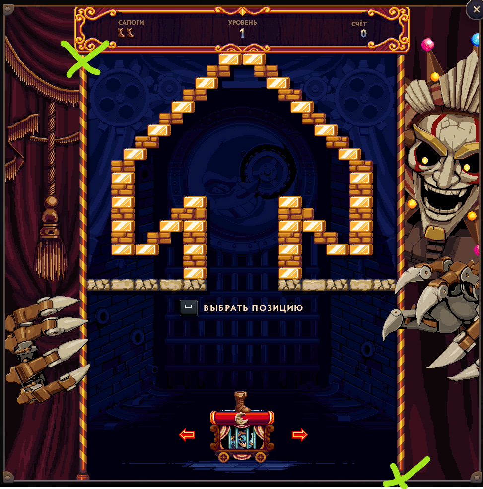

# Boot Catcher Rust

## Build

```powershell
cargo check
cargo build --release
```

`cargo check` works with the installed Rust toolchain. `cargo build --release` on Windows also needs the MSVC linker from Visual Studio Build Tools with the C++ workload.

## Run

```powershell
cargo run --release -- --fps 60
```

Options:

- `--fps N`
- `--debug`
- `--log-file PATH`
- `--template PATH`
- `--no-startup`

## Startup position helper

At the game's startup position picker, select one of the two marked corner zones:



- upper-left zone
- lower-right zone

These zones keep the boot picker away from the central playfield and give the detector a clear screen layout before the run starts. After selecting a position, start the run normally.

The Rust version uses WinAPI directly:

- GDI `BitBlt` screen capture
- `SendInput` for A/D/Space
- pure Rust motion/color ROI detection
- TSV profiling log

Stop with `Ctrl+C`; the handler releases A/D before exit.
